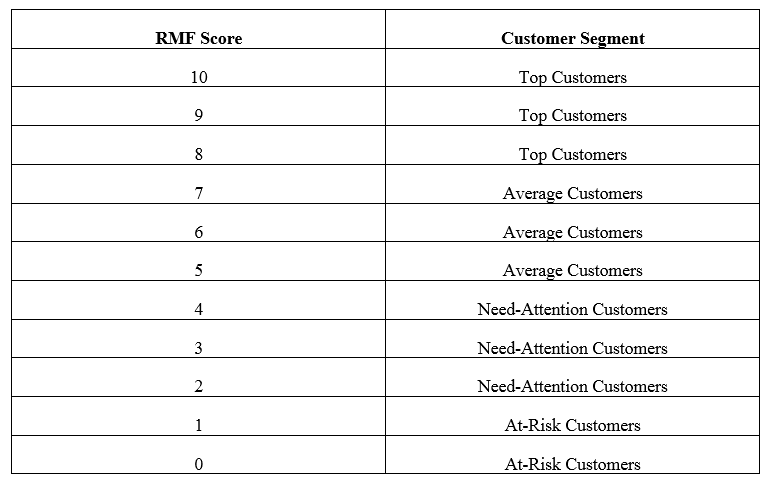
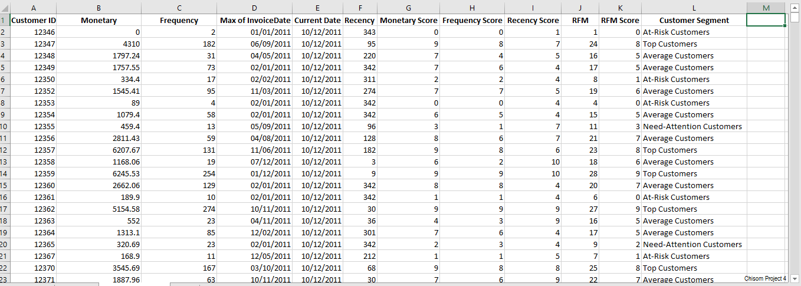
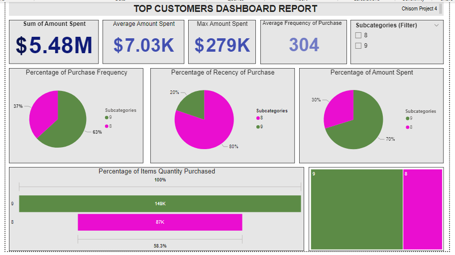
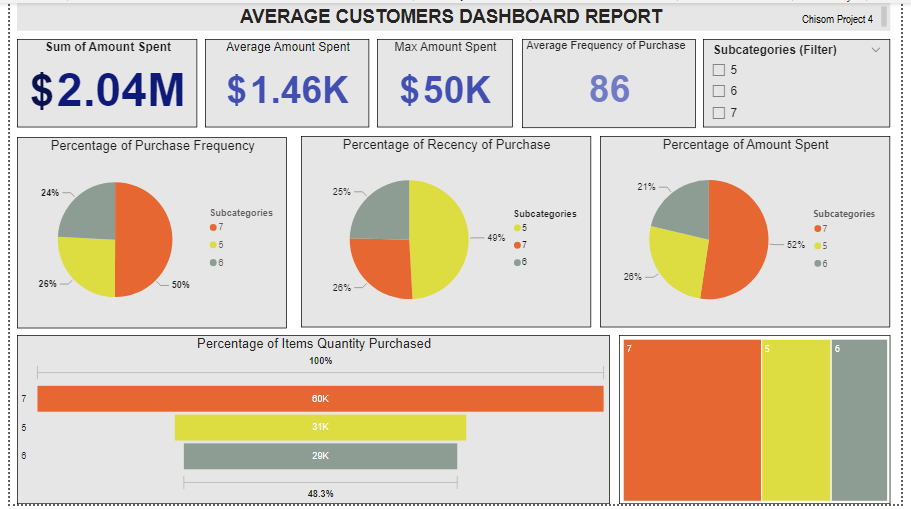
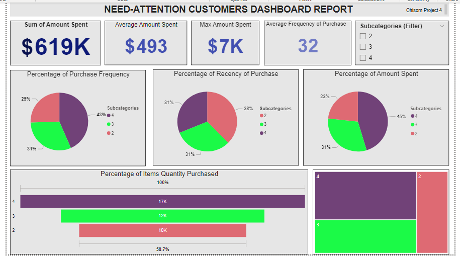
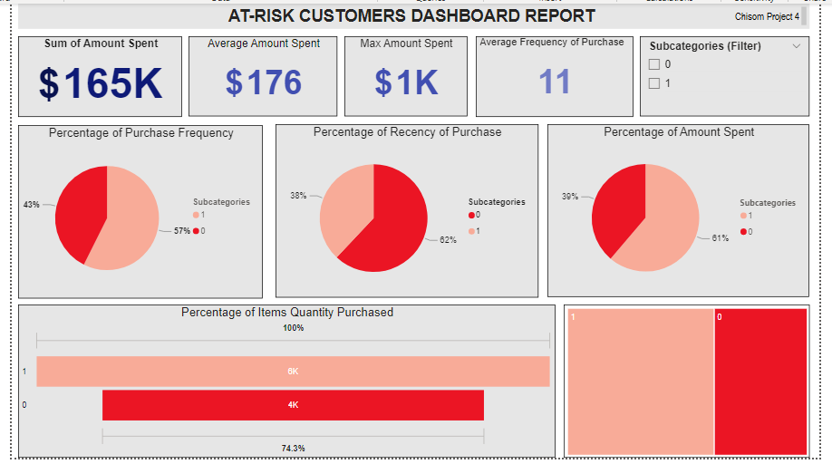
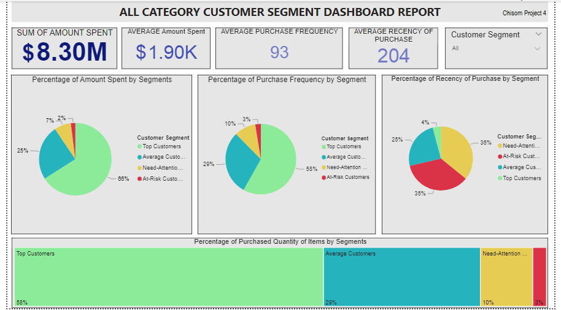
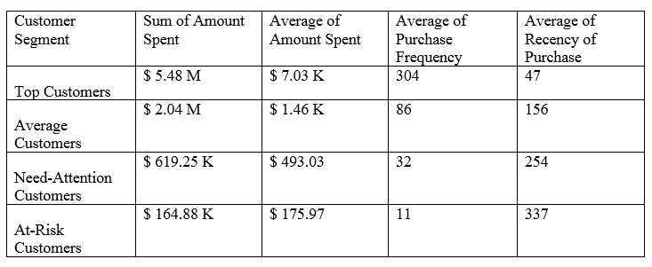

# Customer-Segmentation-for-Marketing-Campaign

## Introduction

In this Portfolio, I have executed customer segmentation on the dataset to obtain business insights for targeted marketing campaigns. I used **Microsoft Excel software** for data wrangling and data analysis, while I used **Microsoft Power BI** for data visualization.

## Objective

I ranked and grouped the customers to identify the most valuable customers, and customers requiring attention, so as to build up a great marketing campaign strategy that will envelop the different groups and ranks of customers.

## Approach (Method)

The customer segmentation used is by Ranking and Grouping customers based on the recency, frequency and monetary (RFM) total of customers transactions. As this will aid to identify the best and top customers and provide insights for informed decisions on marketing campaign strategies and targets.

**_Disclaimer:_** The raw dataset used for this portfolio was obtained from Kaggle.com with the link [here](https://www.kaggle.com/datasets/carrie1/ecommerce-data) , and can also be accessed through this link [here](https://github.com/Great-Chisom/Customer-Segmentation-for-Marketing-Campaign/blob/main/data.csv.zip) from my GitHub account.

## Step 1: Data Wrangling

Here, I organized the dataset for easy data analysis using the RFM (recency, frequency and monetary) model.
With the data source from Kaggle, I moved directly into analysis.
First, I created a column to obtain the total amount spent by each customer uniquely according to their customer id. So, in column I, I created a column with the header **Amount Spent**, where the amount spent is the quantity (column D) multiplied by Unit Price (column F). Using the syntax below, I populated the rows under this particular column. 

      = D2 * F2 

Next, I created a Pivot Table of the dataset where I considered the following variables; Customer ID,  Amount Spent, Count of Invoices and Invoice Dates. The **Pivot Table** tool is accessed through the **INSERT Tab**.
 Using the new pivot table data, I created a new Excel worksheet tabled dataset. Here, I changed the datatype of **Max of Invoice Date** to **short date** data type, using the **short date** tool in the **Number section** tools under the **Home Tab**. Also, I changed the headers; **Sum of Amount Spent** to **Monetary**, and **Count of Invoices** to **Frequency**.
I created a column with the header **Current Date** to enter values of a defined date, which represents the speculated date considered in the time frame range. I used the most recent date value in the **Max of Invoice Date** column to represent this value. I used the syntax below to obtain this value. 

    = MAX ( D2:D4373 )

and I populated the value throughout the column (Column E), after making the datatype a **short date**.
Next, I created a column with the header **Recency**. The Recency is the difference (in days) between the purchased date (**Invoice Date**) and the speculated recent date (**Current Date**). This calculation is obtained using the syntax below:

    = DAYS ( E2, D2 )

and the syntax was used across the **Recency** column for each customer.
Hence, the **Monetary** column represents the total amount spent by each customer according to their unique id, the **Frequency** column represents how many times each customer made a purchase(s), and the **Recency** column represents how recently each customer made a purchase.
Next, I created Score columns for each customer in reference to the **RFM** model. This Score ranks customers to a set, identified by a number from (topmost) 10 to (least) 1. 
To do this, I created a new column with the header **Monetary Score**, where I ranked customer(s) according to their monetary value using the syntax below:

    = PERCENTRANK.INC ( $B$2:$B$4373, B2, 1 ) * 10

and the syntax was used across the **Monetary Score** column for each customer.
Next, I created a **Frequency Score** column, where I ranked customer(s) according to their frequency value using the syntax below:

    = PERCENTRANK.INC ( $C$2:$C$4373, C2, 1 ) * 10

and the syntax was applied across the **Frequency Score** column.
Next, I created a **Recency Score** column, where I ranked customer(s) according to their recency value using the syntax below;

  = ( 1 – PERCENTRANK.INC ( $F$2:$F$4373, F2 , 1 )) * 10

## Step 2: Data Analysis and Visualization

### Customers Grouping

Here, I narrowed down and grouped customers across the three **RFM score** columns. This helped reduce the stress of applying multiple filter selections across the three **RFM score** columns. To achieve this, I created a concatenated **RFM** column, which contains the sum of values across the individual **Recency Score** column, **Frequency Score** column, and **Monetary Score** column, using the syntax below:

    = SUM ( G2, H2, I2 )

and I populated the entire column using the above syntax.
Next, I created an RFM Score column which contains a value(s) populated across the column using the syntax below

    = PERCENTRANK.INC ( $J$2:$J$4373, J2, 1 ) * 10

Before using the **VLOOKUP** function to group (describe) customers. First, I created a table with the header **Customer Segment**, which contained the descriptive groups of customers as defined in Table 1 below.

**Table 1: Customer Segmentation**

Then, I used the **VLOOKUP** function syntax below to populate the Customer Segment column. 

    = VLOOKUP ( K2, $O$3:$P$13, 2, FALSE )

The table can be previewed below, and the complete table can be accessed with the link [here](https://github.com/Great-Chisom/Customer-Segmentation-for-Marketing-Campaign/blob/main/Excel_Table_1.xlsx)

**Table 2: Table Preview**

## Subcategory View 1

Looking into Top Customers analysis.

    Title: Top Customers Analysis Dashboard Report

**Remark:**
In the category of Top Customers, it is observed that;
•	Subcategory **9** customers often make more purchases by 63% and during which they spent more on items by 70%, which makes them buy more quantity of items, when compared to their counterpart subcategory **8** customers.
•	 Also, subcategory **9** customers spend an average amount of $ 11.47 thousand with an average spending frequency of 446, while subcategory **8** customers spend an average amount of $ 3.68 thousand with an average spending frequency of 196.
These statistics can be accessed through the Power BI interactive dashboard by clicking on the link [here](https://app.powerbi.com/groups/me/reports/84ceb964-3087-40dc-a34b-b11b1875e3de/ReportSection?experience=power-bi)

## Subcategory View 2

Looking into Average Customers analysis.

  Title: Average Customer Analysis Dashboard Report 

**Remark:**
In the category of Average customers, it is observed that;
•	Subcategory **7** customers often make more purchases by 50% and during which they spend more on items by 52% which makes them buy more quantity of items when compared to the other two subcategories **6** and **5**.
•	With regards to the two subcategories **6** and **5**, there is no significant difference in their purchase frequency and amount spent on purchasing items. However, subcategory **5** customers tend to regularly purchase items of recent.
•	Also, it is observed that subcategory **7** customers spend an average of $ 2.10 thousand with an average spending frequency of 118, and subcategory **6** customers spend an average of $ 1.27 thousand with an average spending frequency of 85, while subcategory **5** customers spend an average of $ 978 with an average spending frequency of 56.
These statistics can be accessed through the Power BI interactive dashboard by clicking on the link [here](https://app.powerbi.com/groups/me/reports/84ceb964-3087-40dc-a34b-b11b1875e3de/ReportSectionf81625514e1e57eac2d3?experience=power-bi) .

## Subcategory View 3

Looking into Need-Attention Customers analysis.

    Title: Need-Attention Analysis Dashboard Report 

**Remark:**
In the Category of Need-Attention customers, it is observed that;
•	There is no significant difference between the three subcategories **4**, **3**, and **2**. 
•	However, it is observed that subcategory **4** customers spend an average of $ 676 with an average spending frequency of 42, and subcategory **3** customers spend an average of $ 487 with an average spending frequency of 31, while subcategory **2** customers spend an average of $ 327 with an average spending frequency of 23.
These statistics can be accessed through the Power BI interactive dashboard by clicking on the link [here](https://app.powerbi.com/groups/me/reports/84ceb964-3087-40dc-a34b-b11b1875e3de/ReportSectionf12b106cff5a5cb93b8c?experience=power-bi) .

## Subcategory View 4

Looking into At-Risk Customers Analysis

    Title: At-Risk Analysis Dashboard Report 

**Remark:**
In the category of At-Risk customers, it is observed that;
•	There is no significant difference between the two subcategories **1** and **0**.
•	However, it is observed that subcategory **1** customers spend an average of $ 258 with an average spending frequency of 15, while subcategory **0** customers spend an average of $ 590 with an average purchase frequency of 8.
And these statistics can be accessed through the Power BI interactive dashboard by clicking on the link [here](https://app.powerbi.com/groups/me/reports/84ceb964-3087-40dc-a34b-b11b1875e3de/ReportSection2dbf8206d184221088c6?experience=power-bi) .

## Category View

Here, looking into the analysis of the customer segments collectively

   Title: Customer Segment Analysis Dashboard Report

**Remark:**
The Dashboard Report above shows that
•	The Top Customers form an active major customer population in terms of the amount spent on purchasing items (66%) and in the frequency of purchasing items (58%). The low percentage of Top Customers in the recency of purchase field (4%) implies that this segment of customers buys a bulk quantity of items when they make purchases, which is revealed by a 58% representation on the dashboard.
Next in significance, is the Average Customers segment which has the percentage of amount spent on purchasing items pegged at 25% and their percentage frequency of purchasing items pegged at 29%, with their recency of purchasing items pegged at 28%.
•	However, the least participating customer segment is the At-Risk customer segment, followed by the Need-Attention Customer segment. Though the dashboard reveals that these two segments have a high recency purchase percentage both pegged at a sum percentage of 60%.
•	Also, the dashboard reveals the summary report below;

**Table 3: RFM Dashboard Summary Report for Various Customer Segments**

## Conclusion

From the **RFM** (recency, frequency, monetary) model applied above, I was able to identify four major customer segments for targeting based on customer performance ranking. The four customer segmentation showed varying characteristics, which will require a varying approach to marketing campaigns.

## Recommendation

It is observed that there is positive customer behavior towards the company’s brands and products.
And since the Top and Average Customers make up a majority of the customers evaluated, it is advisable that the marketing campaign and sales execution strategy be focused on up-selling company brands and products. 
Also, every customer should be engaged actively, since the At-Risk and Need-Attention Customers have a high recency percentage of about 71%, this implies that these customer segments are new customers to the company products and they are unaware of the company’s products. Hence, it is advisable to execute product adverts and promotions to this segment of customers and prospects informed about the company’s products and brands. 

## Appreciation:

Thank you for reading through, and feel free to drop a comment or suggestions. Optionally, you can click here to access the interactive Power BI dashboard [here](https://app.powerbi.com/groups/me/reports/84ceb964-3087-40dc-a34b-b11b1875e3de/ReportSectioncb8ef983eeffd300bcdf?experience=power-bi), and the video clip of the Power BI dashboard Report is displayed below.

https://github.com/Great-Chisom/Customer-Segmentation-for-Marketing-Campaign/assets/132842315/5f6e64d9-7901-45f3-8106-f961587b9ef5

